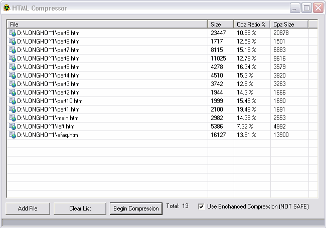



## HTML File Compression with enhanced compression

### Description

Compress your HTML files and reduce download time. HTML compression tool reduces the size of your HTML file almost upto 50%. When you build a html file there are lots of useless bytes which comsumes space. HTML compression tool removes those extra bytes,doing this will tightly compact your HTML code. You can also note the percentage ratio of the compressed file. This tool uses ENHANCED COMPRESSION- by enabling this feature you can eliminate all the extra tags which are not necessary. COmpress multiple files at once,this utility is extremely fast and free. It uses easy to understand code and also comes with a sample HTML file. I've seen many people selling it for $$$. So please vote for me.
 
### More Info
 

             |
---                |---
**Submitted On**   |2004-02-03 14:58:04
**By**             |[Sriharish\.H](https://github.com/Planet-Source-Code/PSCIndex/blob/master/ByAuthor/sriharish-h.md)
**Level**          |Beginner
**User Rating**    |5.0 (10 globes from 2 users)
**Compatibility**  |VB 5\.0, VB 6\.0
**Category**       |[Internet/ HTML](https://github.com/Planet-Source-Code/PSCIndex/blob/master/ByCategory/internet-html__1-34.md)
**World**          |[Visual Basic](https://github.com/Planet-Source-Code/PSCIndex/blob/master/ByWorld/visual-basic.md)
**Archive File**   |[HTML\_File\_170367232004\.zip](https://github.com/Planet-Source-Code/sriharish-h-html-file-compression-with-enhanced-compression__1-51467/archive/master.zip)

